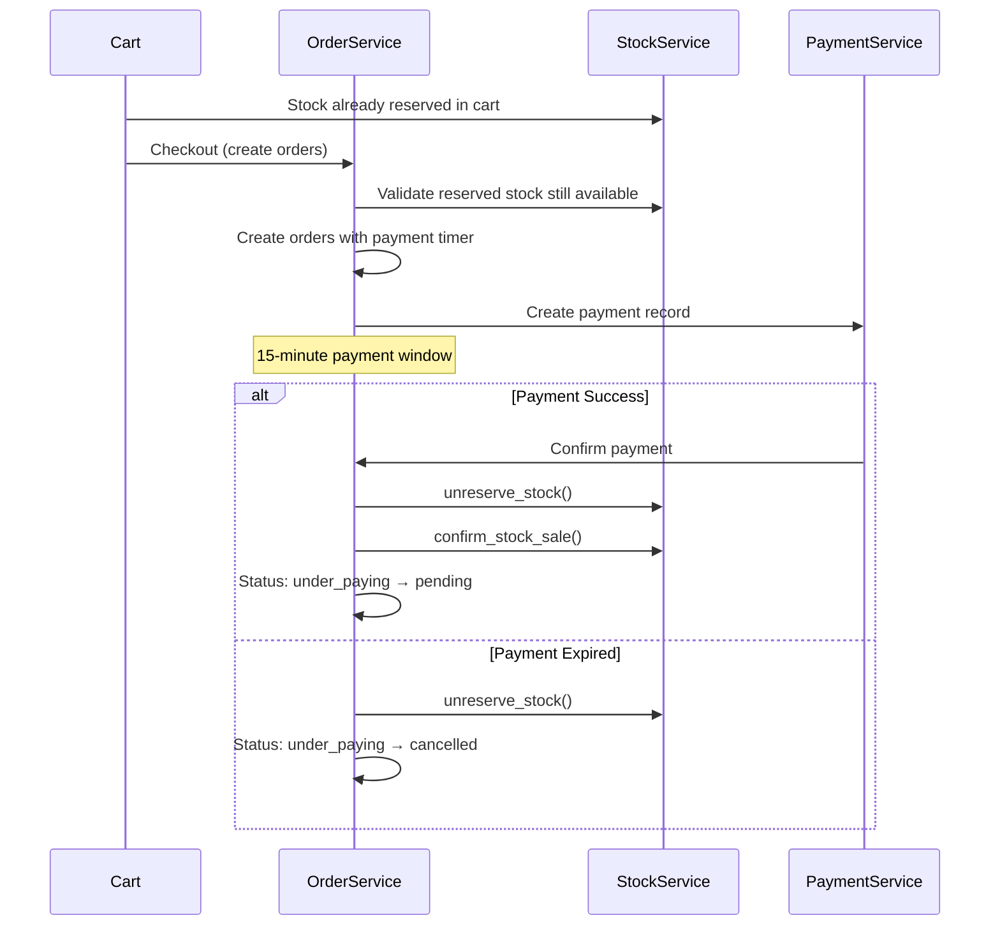

# StockService Integration with Orders App

## Overview
The enhanced StockService provides robust stock management that significantly improves the Orders app's reliability, accuracy, and user experience. Here's a comprehensive analysis of the integration effects.

## 🔄 Integration Points

### 1. Order Creation Flow


### 2. Stock Lifecycle in Orders
```mermaid
graph TD
    A[Add to Cart] --> B[StockService.reserve_stock()]
    B --> C[Stock Reserved in Cart]
    C --> D[Create Order - Stock Still Reserved]
    D --> E{Payment Completed?}
    
    E -->|Yes| F[StockService.unreserve_stock()]
    F --> G[StockService.confirm_stock_sale()]
    G --> H[Order Status: pending]
    
    E -->|Timeout| I[StockService.unreserve_stock()]
    I --> J[Order Status: cancelled]
```

## 🎯 Key Effects on Orders App

### 1. Enhanced Payment Confirmation
**Before (Manual Stock Handling):**
```python
# Old approach - direct database manipulation
if order.product.has_sizes:
    size_obj = Size.objects.get(product=order.product, size=size)
    size_obj.available_quantity -= order.quantity
    size_obj.save()
else:
    order.product.available_quantity -= order.quantity
    order.product.save()
```

**After (StockService Integration):**
```python
# New approach - using StockService
try:
    # Convert reserved stock to actual sale
    StockService.unreserve_stock(order.product.id, order.quantity, size=size)
    StockService.confirm_stock_sale(order.product.id, order.quantity, size=size)
except ValidationError as e:
    # Proper error handling with rollback
    raise ValidationError(f"Stock processing failed: {str(e)}")
```

### 2. Improved Error Handling
The StockService provides comprehensive error handling that benefits the Orders app:

```python
# StockService handles all edge cases:
- Product not found
- Size not available
- Insufficient stock
- Negative reserved quantities
- Database locking for concurrent access
- Detailed logging for debugging
```

### 3. Automatic Cleanup Integration
**Payment Timer Cleanup:**
```python
@staticmethod
@transaction.atomic
def cleanup_expired_payments():
    """Enhanced cleanup using StockService"""
    expired_orders = Order.objects.filter(
        status='under_paying',
        payment_expires_at__lt=timezone.now()
    )
    
    for order in expired_orders:
        try:
            # Use StockService for reliable unreservation
            size = None
            if order.product_variation and 'size' in order.product_variation:
                size = order.product_variation['size']
            
            StockService.unreserve_stock(
                product_id=order.product.id,
                quantity=order.quantity,
                size=size
            )
            
            # Update order status
            order.status = 'cancelled'
            order.payment_status = 'expired'
            order.save()
            
        except Exception as e:
            # Log error but continue with other orders
            logger.error(f"Cleanup failed for order {order.order_id}: {e}")
```

## 🚀 Benefits for Orders App

### 1. Data Consistency
- **Atomic Operations**: All stock operations are wrapped in database transactions
- **Race Condition Prevention**: select_for_update() prevents concurrent access issues
- **Rollback Safety**: Failed operations don't leave inconsistent data

### 2. Better Error Messages
```python
# StockService provides detailed error messages:
{
    "error_code": "INSUFFICIENT_STOCK",
    "error_message": "Not enough stock available for this size.",
    "available_quantity": 5,
    "requested_quantity": 10,
    "size": "L"
}
```

### 3. Enhanced Monitoring
```python
# StockService provides detailed logging:
logger.info("Reserved 2 units of size M for product 123")
logger.info("Confirmed sale of 2 units of size M for product 123")
logger.warning("Reserved quantity went negative (adjusting to 0)")
logger.error("Size L not found for product 123")
```

### 4. Validation Capabilities
```python
# Before order creation, validate stock availability:
availability = StockService.check_stock_availability(
    product_id=123, 
    quantity=2, 
    size="M"
)

if not availability['available']:
    raise ValidationError(f"Insufficient stock: {availability['error']}")
```

## 🔧 Updated OrderService Methods

### 1. Enhanced Payment Confirmation
```python
@staticmethod
@transaction.atomic
def confirm_payment_for_orders(payment_hash, payment_key):
    """Enhanced with StockService integration"""
    orders = Order.objects.filter(
        payment_hash=payment_hash,
        payment_key=payment_key,
        status='under_paying'
    )
    
    processed_orders = []
    
    for order in orders:
        try:
            # Extract size information
            size = None
            if order.product_variation and 'size' in order.product_variation:
                size = order.product_variation['size']
            
            # Use StockService for stock conversion
            StockService.unreserve_stock(order.product.id, order.quantity, size=size)
            StockService.confirm_stock_sale(order.product.id, order.quantity, size=size)
            
            # Update order status
            order.payment_status = 'completed'
            order.status = 'pending'
            order.paid_at = timezone.now()
            order.save()
            
            processed_orders.append(order)
            
        except Exception as e:
            # Rollback all changes if any order fails
            raise ValidationError(f"Stock processing failed for {order.product.product_name}: {str(e)}")
    
    return processed_orders
```

### 2. Enhanced Cleanup Process
```python
@staticmethod
@transaction.atomic
def cleanup_expired_payments():
    """Improved cleanup with StockService"""
    expired_orders = Order.objects.filter(
        status='under_paying',
        payment_expires_at__lt=timezone.now()
    ).select_for_update()
    
    cleanup_results = {
        'processed_count': 0,
        'failed_count': 0,
        'errors': []
    }
    
    for order in expired_orders:
        try:
            # Extract size information
            size = None
            if order.product_variation and 'size' in order.product_variation:
                size = order.product_variation['size']
            
            # Use StockService for reliable unreservation
            StockService.unreserve_stock(
                product_id=order.product.id,
                quantity=order.quantity,
                size=size
            )
            
            # Update order status
            order.status = 'cancelled'
            order.payment_status = 'expired'
            order.admin_notes = f"Payment expired at {order.payment_expires_at}. Stock unreserved automatically."
            order.save()
            
            cleanup_results['processed_count'] += 1
            
        except Exception as e:
            cleanup_results['failed_count'] += 1
            cleanup_results['errors'].append({
                'order_id': order.order_id,
                'error': str(e)
            })
            continue
    
    return cleanup_results
```

## 📊 Performance Improvements

### 1. Reduced Database Queries
- **Before**: Multiple individual queries for stock operations
- **After**: Optimized queries with select_for_update() and bulk operations

### 2. Better Concurrency Handling
- **Database Locking**: Prevents race conditions during high traffic
- **Transaction Safety**: Ensures data consistency during concurrent operations
- **Error Recovery**: Graceful handling of failed operations

### 3. Improved Monitoring
```python
# Stock operations are now trackable:
stock_info = StockService.get_stock_info(product_id=123, size="M")
print(f"Available: {stock_info['available_quantity']}")
print(f"Reserved: {stock_info['reserved_quantity']}")
print(f"Sold: {stock_info['sold_quantity']}")
```

## 🎯 Integration Testing

### Test Cases for Orders App
```python
class OrderStockIntegrationTest(TestCase):
    def test_payment_confirmation_stock_conversion(self):
        """Test that payment confirmation properly converts stock"""
        # Create order with reserved stock
        order = self.create_test_order()
        
        # Verify stock is reserved
        stock_info = StockService.get_stock_info(order.product.id, order.size)
        self.assertGreater(stock_info['reserved_quantity'], 0)
        
        # Confirm payment
        OrderService.confirm_payment_for_orders(order.payment_hash, order.payment_key)
        
        # Verify stock conversion
        updated_stock = StockService.get_stock_info(order.product.id, order.size)
        self.assertEqual(updated_stock['reserved_quantity'], 0)
        self.assertGreater(updated_stock['sold_quantity'], 0)
    
    def test_payment_expiry_stock_cleanup(self):
        """Test that expired payments properly release stock"""
        # Create expired order
        order = self.create_expired_order()
        
        # Run cleanup
        results = OrderService.cleanup_expired_payments()
        
        # Verify stock was unreserved
        stock_info = StockService.get_stock_info(order.product.id, order.size)
        self.assertEqual(stock_info['reserved_quantity'], 0)
        
        # Verify order was cancelled
        order.refresh_from_db()
        self.assertEqual(order.status, 'cancelled')
```

## 🚨 Error Scenarios Handled

### 1. Insufficient Stock During Payment
```python
# Scenario: Stock sold elsewhere during payment window
try:
    OrderService.confirm_payment_for_orders(payment_hash, payment_key)
except ValidationError as e:
    # StockService will detect insufficient stock
    # Order remains in under_paying status
    # User gets clear error message
    return {"error": "Stock no longer available", "suggested_action": "Try again"}
```

### 2. Concurrent Order Processing
```python
# Scenario: Multiple users trying to buy last item
# StockService uses select_for_update() to prevent race conditions
# Only one order will succeed, others will get insufficient stock error
```

### 3. Database Connection Issues
```python
# Scenario: Database connection lost during stock operation
# Transaction rollback ensures no partial stock updates
# Order status remains unchanged
# User can retry payment
```

## 📈 Monitoring and Analytics

### Stock Movement Tracking
```python
# Track stock movements through order lifecycle:
1. Cart Addition: +reserved_quantity, -available_quantity
2. Order Creation: Stock stays reserved
3. Payment Success: -reserved_quantity, +sold_quantity
4. Payment Failure: +available_quantity, -reserved_quantity
```

### Key Metrics
- **Stock Reservation Rate**: How much stock is currently reserved
- **Conversion Rate**: Reserved → Sold conversion percentage
- **Expiry Rate**: Reserved → Released due to timeout
- **Stock Accuracy**: Comparison between system stock and actual inventory

The StockService integration significantly enhances the Orders app by providing robust, reliable, and well-monitored stock management that handles all edge cases and provides excellent user experience.
