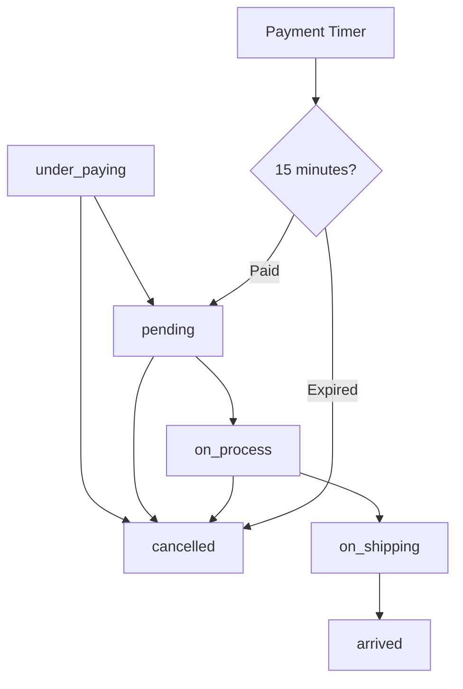
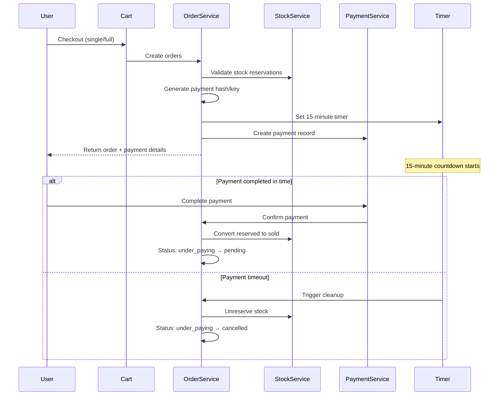
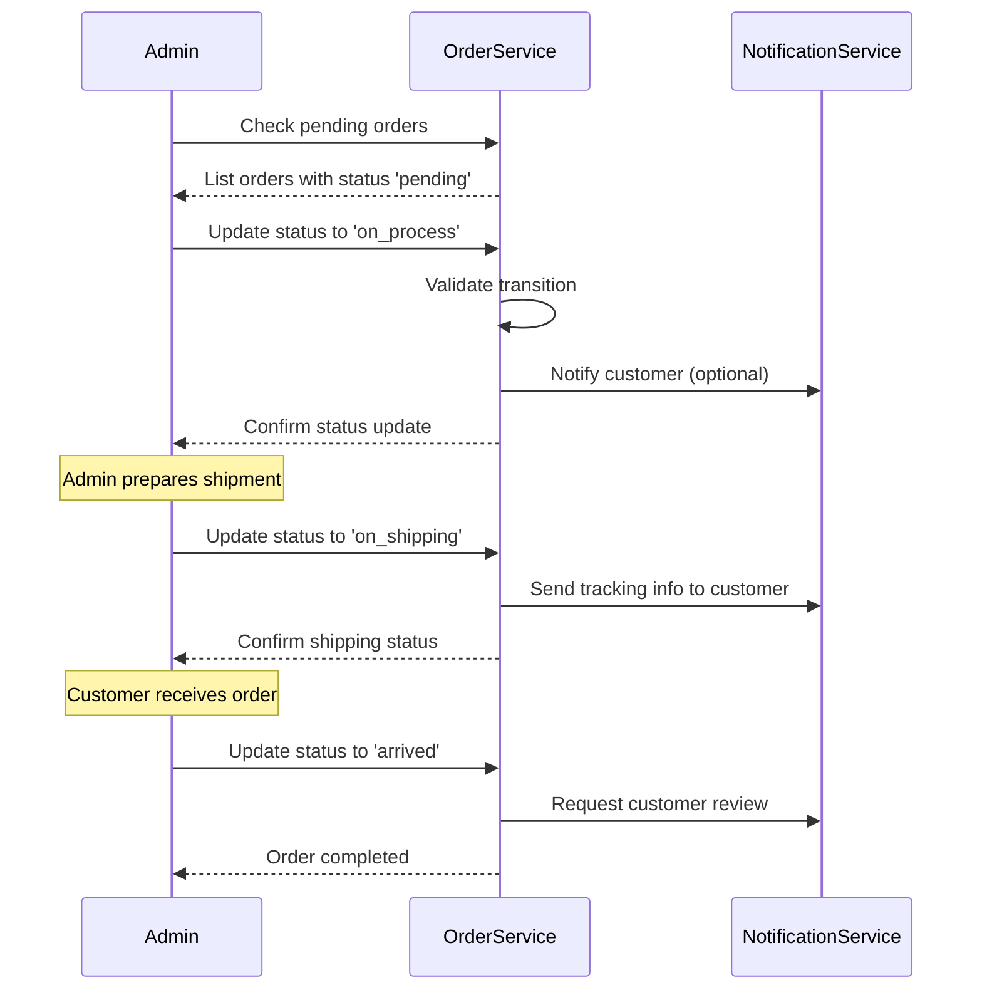
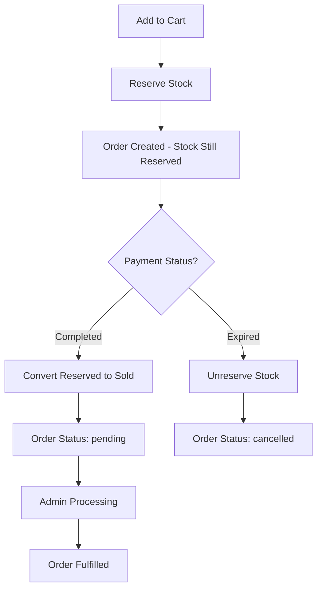

# Orders App Documentation

## Overview
The orders app manages the complete order lifecycle for the Sudamall e-commerce platform. It provides comprehensive order management with advanced features including product history tracking, payment integration, order status management, customer communications, and detailed analytics.
        ('bank_transfer', 'Bank Transfer'),
        ('mobile_money', 'Mobile Money'),
    ], default='credit_card')
    
    payment_status = models.CharField(max_length=20, choices=[
        ('pending', 'Pending'),
        ('processing', 'Processing'),
        ('completed', 'Completed'),
        ('failed', 'Failed'),
        ('refunded', 'Refunded'),
        ('canceled', 'Canceled'),
        ('expired', 'Expired'),              # NEW: Payment timer expired
    ], default='pending')
    
    # Payment tracking
    payment_reference = models.ForeignKey('payments.Payment', on_delete=models.CASCADE, 
                                         related_name='orders', blank=True, null=True)
    payment_hash = models.CharField(max_length=100, null=True, blank=True)
    payment_key = models.CharField(max_length=100, null=True, blank=True)
    payment_amount = models.DecimalField(max_digits=10, decimal_places=2, null=True, blank=True)
    paid_at = models.DateTimeField(null=True, blank=True)
    
    # Payment timer - NEW FEATURE
    payment_expires_at = models.DateTimeField(null=True, blank=True, 
                                             help_text="Payment deadline for under_paying orders")
    
    # Notes and additional info
    customer_notes = models.TextField(blank=True, help_text="Customer order notes")
    admin_notes = models.TextField(blank=True, help_text="Internal admin notes")
    
    # Timestamps
    created_at = models.DateTimeField(auto_now_add=True)
    updated_at = models.DateTimeField(auto_now=True)
    
    # Properties for payment timer
    @property
    def is_payment_expired(self):
        """Check if payment time limit has been exceeded"""
        if self.status != 'under_paying' or not self.payment_expires_at:
            return False
        return timezone.now() > self.payment_expires_at
    
    @property
    def payment_time_remaining(self):
        """Get remaining time for payment in seconds"""
        if self.status != 'under_paying' or not self.payment_expires_at:
            return 0
        remaining = self.payment_expires_at - timezone.now()
        return max(0, int(remaining.total_seconds()))
```

## Order Status Workflow

### Status Transitions


### Status Descriptions

| Status | Description | Timer Active | Business Action Required |
|--------|-------------|--------------|-------------------------|
| `under_paying` | Payment window active | ✅ 15 minutes | No - Automatic timeout |
| `pending` | Payment completed, awaiting processing | ❌ | Yes - Start processing |
| `on_process` | Business owner processing order | ❌ | Yes - Prepare shipment |
| `on_shipping` | Order shipped, in transit | ❌ | Yes - Track delivery |
| `arrived` | Order delivered successfully | ❌ | No - Order complete |
| `cancelled` | Order cancelled (manual or auto) | ❌ | No - Process refund if needed |

## Payment Timer System

### Timer Configuration
```python
# Default settings (configurable)
PAYMENT_TIMEOUT_MINUTES = 15  # 15-minute payment window
CLEANUP_INTERVAL_SECONDS = 300  # Check every 5 minutes
REMINDER_BEFORE_EXPIRY = 5      # Send reminder 5 minutes before expiry
```

### Timer Lifecycle
1. **Order Creation**: Timer starts when order status = 'under_paying'
2. **Payment Window**: User has 15 minutes to complete payment
3. **Reminder**: Optional notification 5 minutes before expiry
4. **Expiration**: Automatic cleanup if payment not completed
5. **Cleanup**: Stock unreserved, order cancelled, payment marked expired

### Automatic Cleanup Process
```python
# Celery task runs every 5 minutes
@shared_task
def cleanup_expired_payment_orders():
    expired_orders = Order.objects.filter(
        status='under_paying',
        payment_expires_at__lt=timezone.now()
    )
    
    for order in expired_orders:
        # Unreserve stock
        StockService.unreserve_stock(order.product.id, order.quantity, order.size)
        
        # Update order status
        order.status = 'cancelled'
        order.payment_status = 'expired'
        order.admin_notes = f"Payment expired at {order.payment_expires_at}"
        order.save()
```

## API Endpoints

### Order Management
```http
GET /api/orders/                           # List user's orders
GET /api/orders/{order_id}/               # Get order details
PUT /api/orders/{order_id}/status/        # Update order status (admin)
```

### Payment Timer Endpoints
```http
GET /api/orders/payment-status/{order_id}/    # Check payment timer status
POST /api/orders/check-payment/{order_id}/    # Check and update payment status
```

### Admin Cleanup Endpoints
```http
GET /api/orders/admin/expired-count/           # Count expired orders
POST /api/orders/admin/cleanup/expired/       # Manual cleanup
POST /api/orders/admin/trigger-cleanup-task/  # Trigger Celery cleanup
```

## Detailed API Reference

### Check Payment Status
```http
GET /api/orders/payment-status/ORD-ABC123/
```

**Response:**
```json
{
    "order_id": "ORD-ABC123",
    "status": "under_paying",
    "payment_status": "pending",
    "is_payment_window_active": true,
    "time_remaining_seconds": 734,
    "payment_expires_at": "2025-07-25T11:45:00Z",
    "message": "Payment window is still active"
}
```

**When Expired:**
```json
{
    "order_id": "ORD-ABC123",
    "status": "under_paying",
    "payment_status": "pending",
    "is_payment_window_active": false,
    "time_remaining_seconds": 0,
    "message": "Payment window has expired. Order will be cancelled automatically."
}
```

### Update Order Status (Admin)
```http
PUT /api/orders/ORD-ABC123/status/
```

**Request Body:**
```json
{
    "new_status": "on_process",
    "admin_notes": "Order confirmed and being prepared for shipping"
}
```

**Response:**
```json
{
    "order_id": "ORD-ABC123",
    "previous_status": "pending",
    "new_status": "on_process",
    "updated_at": "2025-07-25T10:30:00Z",
    "admin_notes": "Order confirmed and being prepared for shipping"
}
```

### Manual Cleanup (Admin)
```http
POST /api/orders/admin/cleanup/expired/
```

**Response:**
```json
{
    "message": "Cleanup completed successfully",
    "results": {
        "processed_count": 5,
        "failed_count": 0,
        "errors": []
    }
}
```

## OrderService Methods

### Core Order Creation
```python
class OrderService:
    @staticmethod
    def create_order_from_cart_item(user, cart_item, shipping_address, payment_method='credit_card'):
        """
        Create single order from cart item with payment timer
        - Generates payment identifiers
        - Sets 15-minute expiration
        - Returns order with timer information
        """
        
    @staticmethod
    def create_orders_from_cart(user, cart_items, shipping_address, payment_method='credit_card'):
        """
        Create multiple orders from cart items with shared payment
        - All orders share same payment hash
        - All orders have same expiration time
        - Returns list of orders
        """
```

### Payment Processing
```python
@staticmethod
def confirm_payment_for_orders(payment_hash, payment_key):
    """
    Confirm payment for one or multiple orders
    - Validates payment credentials
    - Converts reserved stock to actual deduction
    - Updates order status to 'pending'
    - Marks payment as completed
    """
    
@staticmethod
def confirm_payment(order_id, payment_data):
    """
    Confirm payment for single order
    - Legacy method for individual order payment
    - Validates payment hash and key
    - Processes stock deduction
    """
```

### Timer Management
```python
@staticmethod
def cleanup_expired_payments():
    """
    Clean up all expired payment orders
    - Finds orders with expired payment windows
    - Unreserves stock for each order
    - Updates order and payment status
    - Returns cleanup results
    """
    
@staticmethod
def get_expired_orders_count():
    """Get count of orders needing cleanup"""
    
@staticmethod
def check_order_payment_status(order_id):
    """
    Check if order's payment window is still valid
    - Returns detailed timer information
    - Indicates if cleanup needed
    - Provides remaining time
    """
```

### Status Management
```python
@staticmethod
def update_order_status(order_id, new_status, user=None, admin_notes=None):
    """
    Update order status with validation
    - Validates status transitions
    - Updates order with admin notes
    - Returns updated order
    """
```

## Business Logic Flows

### Order Creation Flow


### Admin Order Management Flow


## Stock Integration

### Stock Lifecycle in Orders


### Stock Validation
```python
# Before order creation
def validate_stock_for_order(product, quantity, size=None):
    if product.has_sizes and size:
        size_obj = Size.objects.get(product=product, size=size)
        available = size_obj.available_quantity + size_obj.reserved_quantity
    else:
        available = product.available_quantity + product.reserved_quantity
    
    if quantity > available:
        raise ValidationError(f"Insufficient stock. Available: {available}, Requested: {quantity}")

# After payment confirmation
def convert_reserved_to_sold(order):
    # First unreserve
    StockService.unreserve_stock(order.product.id, order.quantity, order.size)
    
    # Then deduct from available
    if order.product.has_sizes:
        size_obj.available_quantity -= order.quantity
    else:
        order.product.available_quantity -= order.quantity
```

## Error Handling

### Order Errors
```python
ORDER_ERRORS = {
    'ORDER_NOT_FOUND': 'Order not found',
    'PAYMENT_EXPIRED': 'Payment window has expired',
    'INVALID_STATUS_TRANSITION': 'Invalid status transition',
    'INSUFFICIENT_STOCK': 'Insufficient stock for order',
    'PAYMENT_ALREADY_PROCESSED': 'Payment has already been processed',
    'INVALID_PAYMENT_CREDENTIALS': 'Invalid payment hash or key',
    'STOCK_PROCESSING_FAILED': 'Failed to process stock changes',
    'CLEANUP_FAILED': 'Order cleanup process failed'
}
```

### Error Response Format
```json
{
    "success": false,
    "error_code": "PAYMENT_EXPIRED",
    "error_message": "Payment window has expired",
    "order_id": "ORD-ABC123",
    "expired_at": "2025-07-25T11:45:00Z",
    "suggested_action": "Create a new order to purchase these items"
}
```

## Frontend Integration

### Real-time Payment Timer
```javascript
class OrderPaymentTimer {
    constructor(orderId) {
        this.orderId = orderId;
        this.timerInterval = null;
        this.checkInterval = null;
    }
    
    async startTimer() {
        // Get initial status
        const status = await this.checkPaymentStatus();
        
        if (!status.is_payment_window_active) {
            this.handleExpired();
            return;
        }
        
        // Start countdown display
        this.startCountdown(status.time_remaining_seconds);
        
        // Check status every 30 seconds
        this.checkInterval = setInterval(() => {
            this.checkPaymentStatus();
        }, 30000);
    }
    
    startCountdown(remainingSeconds) {
        const timerElement = document.getElementById('payment-timer');
        
        this.timerInterval = setInterval(() => {
            const minutes = Math.floor(remainingSeconds / 60);
            const seconds = remainingSeconds % 60;
            
            timerElement.textContent = `${minutes}:${seconds.toString().padStart(2, '0')}`;
            
            // Warning states
            if (remainingSeconds <= 300) { // 5 minutes
                timerElement.classList.add('warning');
            }
            if (remainingSeconds <= 60) { // 1 minute
                timerElement.classList.add('critical');
            }
            
            if (remainingSeconds <= 0) {
                this.handleExpired();
            }
            
            remainingSeconds--;
        }, 1000);
    }
    
    async checkPaymentStatus() {
        try {
            const response = await fetch(`/api/orders/payment-status/${this.orderId}/`);
            const status = await response.json();
            
            if (!status.is_payment_window_active) {
                this.handleExpired();
                return status;
            }
            
            return status;
        } catch (error) {
            console.error('Failed to check payment status:', error);
        }
    }
    
    handleExpired() {
        clearInterval(this.timerInterval);
        clearInterval(this.checkInterval);
        
        // Show expiration message
        const timerElement = document.getElementById('payment-timer');
        timerElement.textContent = 'EXPIRED';
        timerElement.classList.add('expired');
        
        // Redirect after 3 seconds
        setTimeout(() => {
            window.location.href = '/cart/?expired=true';
        }, 3000);
    }
    
    stop() {
        clearInterval(this.timerInterval);
        clearInterval(this.checkInterval);
    }
}

// Usage
const timer = new OrderPaymentTimer('ORD-ABC123');
timer.startTimer();
```

### Admin Order Management
```javascript
class AdminOrderManager {
    constructor() {
        this.baseURL = '/api/orders/';
    }
    
    async updateOrderStatus(orderId, newStatus, adminNotes = '') {
        try {
            const response = await fetch(`${this.baseURL}${orderId}/status/`, {
                method: 'PUT',
                headers: {
                    'Authorization': `Bearer ${this.authToken}`,
                    'Content-Type': 'application/json'
                },
                body: JSON.stringify({
                    new_status: newStatus,
                    admin_notes: adminNotes
                })
            });
            
            const result = await response.json();
            
            if (response.ok) {
                this.showSuccessMessage(`Order ${orderId} updated to ${newStatus}`);
                this.refreshOrderList();
            } else {
                this.showErrorMessage(result.error_message);
            }
            
            return result;
        } catch (error) {
            console.error('Failed to update order status:', error);
        }
    }
    
    async getExpiredOrdersCount() {
        try {
            const response = await fetch(`${this.baseURL}admin/expired-count/`);
            const result = await response.json();
            
            if (result.needs_cleanup) {
                this.showCleanupNotification(result.expired_orders_count);
            }
            
            return result;
        } catch (error) {
            console.error('Failed to get expired orders count:', error);
        }
    }
    
    async triggerCleanup() {
        try {
            const response = await fetch(`${this.baseURL}admin/cleanup/expired/`, {
                method: 'POST',
                headers: {
                    'Authorization': `Bearer ${this.authToken}`
                }
            });
            
            const result = await response.json();
            
            if (response.ok) {
                this.showSuccessMessage(
                    `Cleanup completed: ${result.results.processed_count} orders processed`
                );
            }
            
            return result;
        } catch (error) {
            console.error('Failed to trigger cleanup:', error);
        }
    }
}
```

## Management Commands

### Manual Cleanup Command
```bash
# Clean up expired orders
python manage.py cleanup_expired_orders

# Dry run to see what would be cleaned
python manage.py cleanup_expired_orders --dry-run

# Verbose output
python manage.py cleanup_expired_orders --verbose

# Example output:
# Starting expired payment orders cleanup...
# Found 5 expired payment orders to process.
# Cleanup completed successfully!
# Processed: 5 orders
# Failed: 0 orders
```

## Monitoring and Analytics

### Key Metrics
- **Payment Conversion Rate**: % of orders that complete payment within timer
- **Average Payment Time**: How long users take to complete payment
- **Expiration Rate**: % of orders that expire without payment
- **Stock Recovery**: Amount of stock recovered from expired orders

### Logging
```python
import logging

order_logger = logging.getLogger('orders')

# Log order lifecycle events
order_logger.info(f"Order created: {order.order_id} - Timer: 15 minutes")
order_logger.info(f"Payment completed: {order.order_id} - Time taken: {payment_time}")
order_logger.warning(f"Order expired: {order.order_id} - Stock unreserved")
order_logger.error(f"Cleanup failed: {order.order_id} - Error: {error_message}")
```

### Database Indexes
```python
# Add to Order model Meta class for performance
class Meta:
    indexes = [
        models.Index(fields=['status', 'payment_expires_at']),  # For cleanup queries
        models.Index(fields=['payment_hash']),                   # For payment processing
        models.Index(fields=['user_id', 'status']),             # For user order lists
        models.Index(fields=['created_at']),                     # For admin reporting
    ]
```

This comprehensive orders system provides robust order lifecycle management with automatic payment timer functionality, ensuring efficient stock management and excellent user experience.
